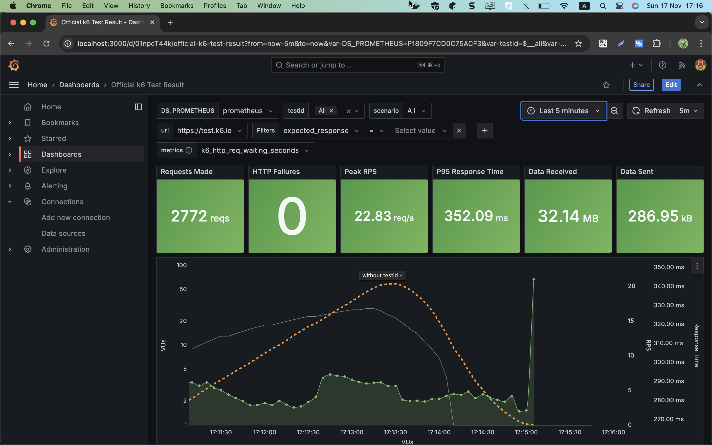
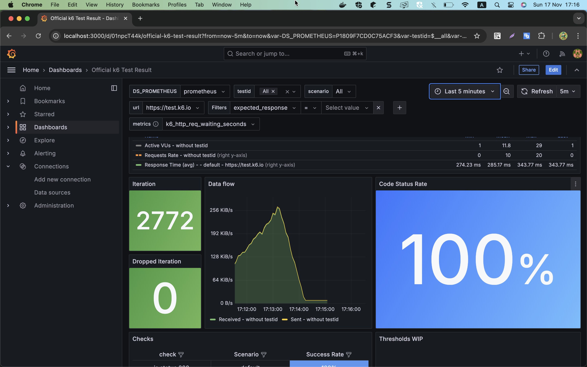
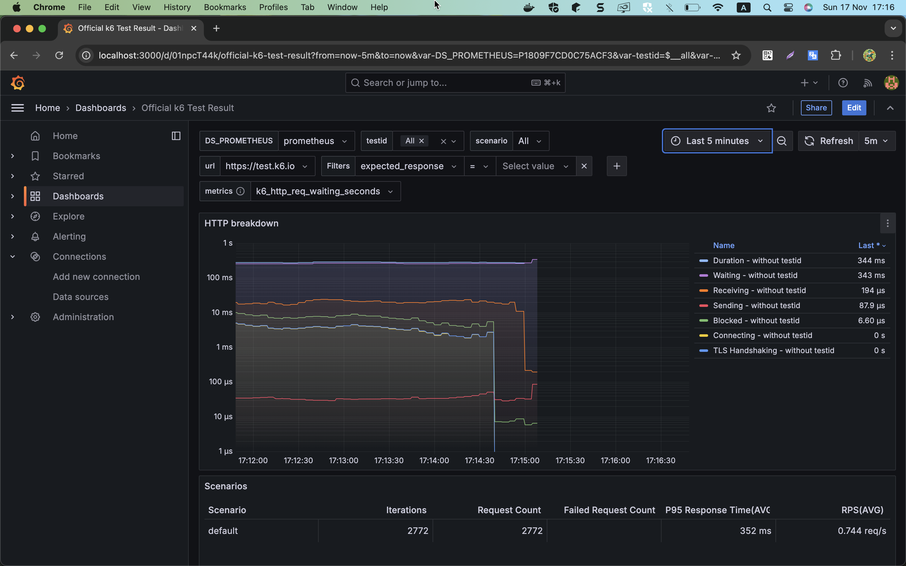

# Demo loading testing with K6 (Distributed testing)
* K6
* Prometheus
* Grafana

## Step to run

1. Install and Run k6 follow [document](https://grafana.com/docs/k6/latest/set-up/install-k6/)

Run K6
```sh
 k6 version
```

Run script with K6
```sh
 k6 run ./k6-script/demo.js
```

2. Run and Store result in Prometheus and Grafana

Start Prometheus
```sh
docker compose up -d prometheus
docker compose ps
docker compose logs --follow
```

Start Grafana
```sh
docker compose up -d grafana
docker compose ps
docker compose logs --follow
```

Access to Grafana http://localhost:3000
* user=admin
* password=admin

Run K6 script manual
```sh
export K6_PROMETHEUS_RW_SERVER_URL=http://localhost:9090/api/v1/write
export K6_PROMETHEUS_RW_TREND_AS_NATIVE_HISTOGRAM=true
export K6_OUT=experimental-prometheus-rw
k6 run ./k6-script/demo.js -o experimental-prometheus-rw
```

or Run K6 script with Docker compose
```sh
docker compose build k6
docker compose up k6 --remove-orphans
```


## Result on Grafana dashboard


<br>


<br>



